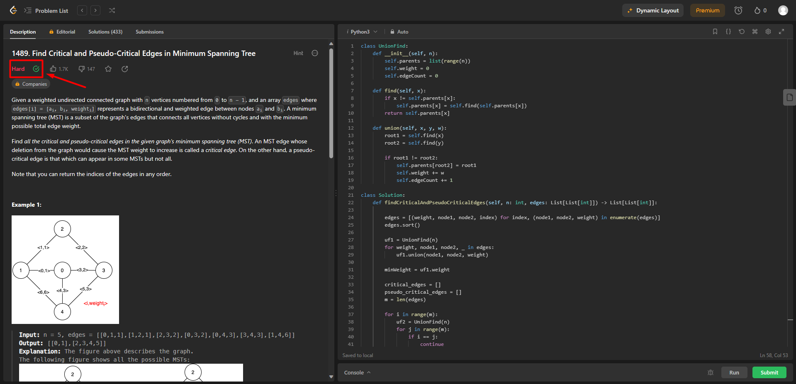
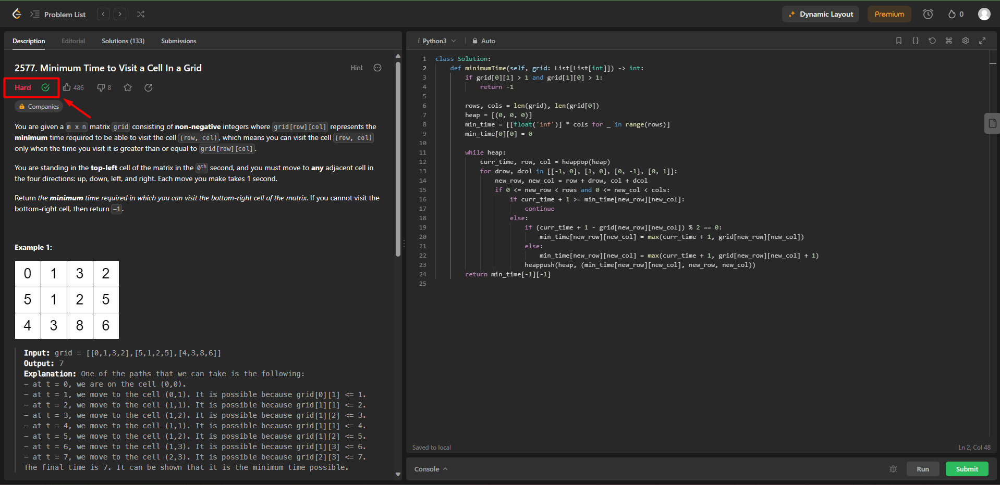

# Questões do LeetCode

**Número da Lista**: 2  
**Conteúdo da Disciplina**: Grafos 2

## Alunos
|Matrícula | Aluno |
| -- | -- |
| 21/1029559  |  Rafael Brito Bosi Rodrigues |

## Sobre 

Este repositório tem como objetivo compilar a resolução de alguns problemas encontrados na plataforma [LeetCode](https://leetcode.com/), tais problemas estão dentro do escopo do conteúde abrangido por Grafos 2 (Algoritmos de Djikstra, Prim e Kruskal).

Exercícios Solucionados:

- [1489 - Find Critical and Pseudo-Critical Edges in Minimum Spanning Tree](https://leetcode.com/problems/find-critical-and-pseudo-critical-edges-in-minimum-spanning-tree/) | **Difícil**
- [2577 - Minimum Time to Visit a Cell In a Grid](https://leetcode.com/problems/minimum-time-to-visit-a-cell-in-a-grid/) | **Difícil**
- [2642 - Design Graph With Shortest Path Calculator](https://leetcode.com/problems/design-graph-with-shortest-path-calculator/) | **Difícil**

## Screenshots

Seguem aqui os screenshots das questões solucionadas, a seta de cada print serve apenas para apontar para o indicador que demonstra que o problema foi resolvido com sucesso.

### 1489 - Find Critical and Pseudo-Critical Edges in Minimum Spanning Tree

Exercício resolvido pelo algoritmo de Kruskal, clique [aqui](./solucoes/1489.py) para ver o código.

### 2577 - Minimum Time to Visit a Cell In a Grid

Exercício resolvido pelo algoritmo de Djikstra, clique [aqui](./solucoes/2577.py) para ver o código.

### 2642 - Design Graph With Shortest Path Calculator

## Instalação 
**Linguagem**: Python 3

Como o LeetCode é uma plataforma online que roda na web, não é necessário baixar nenhum tipo de dependência.

## Uso 

Para testar as soluções aqui propostas basta ir até o arquivo de [soluções](./solucoes/), copiar o código da questão desejada, navegar até o link da questão que pretende testar e subimeter o código ao juiz online.

## Outros 

Para acessar o vídeo onde os códigos e algoritmos são explicados e detalhados, basta clicar [aqui](./videos/).

OBS: Os arquivos de vídeo estão com a extensão .mp4, o que faz necessário o download do arquivo para assistir ao vídeo.

